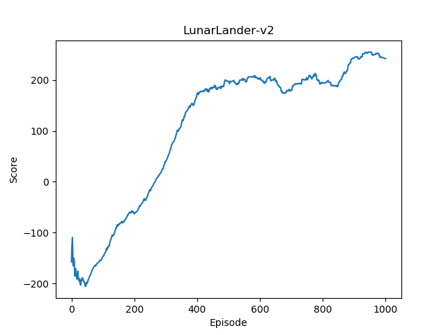
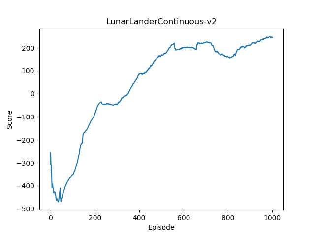

# drl-impl
This is implementations of deep reinforcement learning algorithms.


### Algorithms
- [x] DQN
    - [x] Double Q-learning
    - [x] Dueling Network
    - [x] Prioritised Replay
    - [x] Multi-step learning
- [x] DDPG

## Install requirements
```
$ pip install -r requirements.txt
```

## Usage
Run DQN for [LunarLander-v2](https://gym.openai.com/envs/LunarLander-v2/)
```
$ python run.py --algo DQN
```

Run DDPG for [LunarLanderContinuous-v2](https://gym.openai.com/envs/LunarLanderContinuous-v2/)
```
$ python run.py --algo DDPG
```

## Result
#### DQN

#### DDPG
